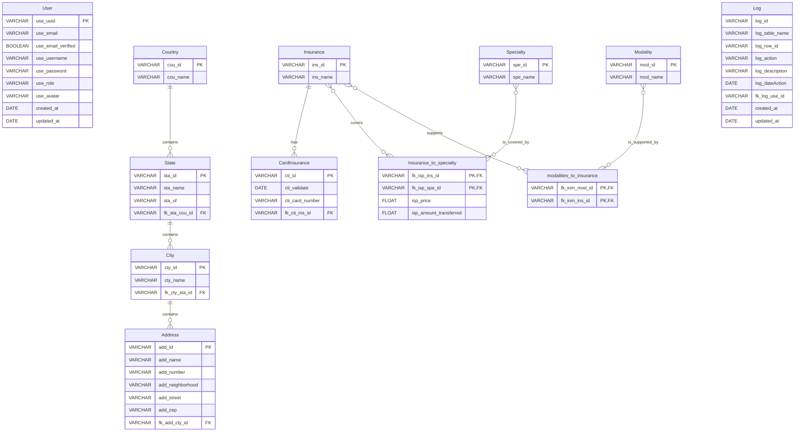

### Entidades e Atributos

Aqui está a lista de todas as entidades identificadas e seus atributos. O atributo que funciona como chave primária (PK) está marcado.

**Entidade: User**

  * `use_uuid` (PK)
  * `use_email`
  * `use_email_verified`
  * `use_username`
  * `use_password`
  * `use_role`
  * `use_avatar`
  * `created_at`
  * `updated_at`

**Entidade: Specialty**

  * `spe_id` (PK)
  * `spe_name`

**Entidade: Insurance**

  * `ins_id` (PK)
  * `ins_name`

**Entidade: Modality**

  * `mod_id` (PK)
  * `mod_name`

**Entidade: CardInsurance**

  * `cti_id` (PK)
  * `cti_validate`
  * `cti_card_number`
  * `fk_cti_ins_id` (FK)

**Entidade: Country**

  * `cou_id` (PK)
  * `cou_name`

**Entidade: State**

  * `sta_id` (PK)
  * `sta_name`
  * `sta_uf`
  * `fk_sta_cou_id` (FK)

**Entidade: City**

  * `cty_id` (PK)
  * `cty_name`
  * `fk_cty_sta_id` (FK)

**Entidade: Address**

  * `add_id` (PK)
  * `add_name`
  * `add_number`
  * `add_neighborhood`
  * `add_street`
  * `add_cep`
  * `fk_add_cty_id` (FK)

**Entidade: Log**
  * `log_id`
  * `log_table_name`
  * `log_row_id`
  * `log_action`
  * `log_description`
  * `log_dateAction`
  * `fk_log_use_id`
  * `created_at`
  * `updated_at`

**Entidade Associativa: Insurance\_to\_specialty**

  * `fk_isp_ins_id` (PK, FK)
  * `fk_isp_spe_id` (PK, FK)
  * `isp_price`
  * `isp_amount_transferred`

**Entidade Associativa: modalities\_to\_insurance**

  * `fk_inm_mod_id` (PK, FK)
  * `fk_inm_ins_id` (PK, FK)

-----

### Relacionamentos e Cardinalidades

A seguir, são descritos os relacionamentos entre as entidades, incluindo o tipo e a cardinalidade de cada um.

1.  **Country e State**

      * **Tipo:** Um para Muitos (1:N)
      * **Descrição:** Um `Country` pode ter vários `State`s, mas cada `State` pertence a um único `Country`.
      * **Cardinalidade:** `Country` (1,1) -- (1,N) `State`

2.  **State e City**

      * **Tipo:** Um para Muitos (1:N)
      * **Descrição:** Um `State` pode ter várias `City`s, mas cada `City` pertence a um único `State`.
      * **Cardinalidade:** `State` (1,1) -- (1,N) `City`

3.  **City e Address**

      * **Tipo:** Um para Muitos (1:N)
      * **Descrição:** Uma `City` pode ter vários `Address`es, mas cada `Address` está localizado em uma única `City`.
      * **Cardinalidade:** `City` (1,1) -- (1,N) `Address`

4.  **Insurance e CardInsurance**

      * **Tipo:** Um para Muitos (1:N)
      * **Descrição:** Um convênio (`Insurance`) pode estar associado a vários cartões (`CardInsurance`), mas cada cartão pertence a um único convênio.
      * **Cardinalidade:** `Insurance` (1,1) -- (0,N) `CardInsurance`

5.  **Insurance e Specialty**

      * **Tipo:** Muitos para Muitos (N:M)
      * **Entidade Associativa:** `Insurance_to_specialty`
      * **Descrição:** Um convênio (`Insurance`) pode cobrir várias especialidades (`Specialty`), e uma especialidade pode ser atendida por múltiplos convênios. A tabela associativa `Insurance_to_specialty` armazena o preço (`isp_price`) e o valor de repasse (`isp_amount_transferred`) para cada combinação.

6.  **Insurance e Modality**

      * **Tipo:** Muitos para Muitos (N:M)
      * **Entidade Associativa:** `modalities_to_insurance`
      * **Descrição:** Um convênio (`Insurance`) pode oferecer suporte a várias modalidades de atendimento (`Modality`), como telemedicina ou presencial, e uma modalidade pode ser aceita por diferentes convênios.
      

7. **Log e Usuário**
    * **Tipo:** Um pra muitos (1:N)
    * **Descrição:** Um usuário pode realizar diversas ações no sistema, portanto, pode haver diversos logs de alteração.
    * **Cardinalidade:** `Log` (N,1) -- (N,1) `Usuário`

**Observação Importante:**
De acordo com o arquivo JSON fornecido, a entidade `User` não possui relacionamentos explícitos com nenhuma outra entidade da base de dados, como `Address` ou `CardInsurance`. Em um sistema real, seria esperado que essas conexões existissem.

-----

### Diagrama MER (Representação Visual)

